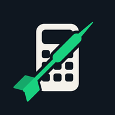

# Finish IT — Dart Outshot Calculator

Type a score and get the best way to finish it. Or let the app follow a live game: it reads your remaining score as you throw, shows the
checkout.

---

## Features

- **Calculator** (`/`) — type a score, get the best finish and the alternatives. Phone-first, light and dark, installable to a home screen
- **Live follower** (`/live`) — follows the board and shows the finish for the current score, with the reader diagnostics one tap away
- **Outshot logic** — every valid 1-, 2- and 3-dart finish for 2–170, with curated preferred paths
- **All finishes table** — browse every checkout from 2 to 170 at `/finishes`
- **Live score reading** — the app reads the remaining score off the screen by template matching, with Tesseract as a fallback
- **LED status ring** — a WLED ring shows how far you are from a finish: red at 170 through to green near the double, blue when there is no checkout, a pulse when a leg is won
- **Training modes** — three drills at `/training`, scored straight off the board, with the history kept so you can see progress

---

## The pages

| Page | What it is for |
|------|----------------|
| `/` | **The calculator.** Score box, Calculate, the best finish, the alternatives as chips. Nothing on it touches the reader or the LEDs. Opens at a score with `/?score=121`. |
| `/live` | **The board follower.** One big score, the best finish as three dart tiles, more ways in folds. Live mode follows the board; Type mode takes a score by hand. |
| `/finishes` | The full checkout table, 2–170. |
| `/training` | The three training drills and the progress history. |

On a desktop browser the calculator draws a phone body around itself; on a real phone that frame
drops away and the page fills the screen.

**The look.** Ink on chalk, one typeface (Space Grotesk), and one rule: green is reserved for the
finish. The double that ends a route is the only green thing on screen, so the answer is always
where the eye lands. The icon is a calculator with a dart through it, with the dart as its one
green element. `static/icon.svg` is the master; the PNG sizes next to it are exported from it.

---

## Project Structure

```
├── app.py                  # Flask app — score reader, outshot logic, LED ring, API routes
├── capture_templates.py    # Manual template capture tool (live preview + keyboard controls)
├── auto_capture.py         # Automated template capture (0–501) via pyautogui
├── train.py                # CNN trainer for score classification (PyTorch)
├── test_ocr.py             # CLI tool to test OCR on a saved image file
├── test_led.py             # Walks the LED ring through idle and the full score gradient
├── test_training.js        # Runs the training-drill logic under node (no browser)
├── show_region.py          # Debug tool — screenshots the current OCR region
├── static/
│   ├── icon.svg            # App icon master (calculator with a dart)
│   ├── icon-*.png          # Exported sizes: 1024, 512, 192, 180
│   └── manifest.webmanifest
├── templates/
│   ├── index.html          # The calculator (phone-frame design)
│   ├── live.html           # Board follower: live score + reader diagnostics
│   ├── finishes.html       # All finishes table (2–170)
│   └── training.html       # The three training drills + progress history
└── templates_capture/
    └── field2/             # Captured template images (one PNG per score 0–501)
        └── gray/           # Preprocessed grayscale versions
```

---

## Requirements

```
flask
numpy
opencv-python
mss
pytesseract
pyautogui        # for auto_capture.py only
pyperclip        # for auto_capture.py only
torch            # for train.py only
torchvision      # for train.py only
pillow           # for train.py only
```

Install everything:

```bash
pip install flask numpy opencv-python mss pytesseract pyautogui pyperclip torch torchvision pillow
```

Tesseract OCR must also be installed separately:
- **Windows**: [https://github.com/UB-Mannheim/tesseract/wiki](https://github.com/UB-Mannheim/tesseract/wiki) — default path `C:\Program Files\Tesseract-OCR\tesseract.exe`
- **macOS**: `brew install tesseract`
- **Linux**: `sudo apt install tesseract-ocr`

---

## Getting Started

### 1. Run the app

```bash
python app.py
```

Open [http://localhost:5000](http://localhost:5000) for the calculator. That is all the
calculator needs — the remaining steps are only for following a live game.

### 2. Calibrate the OCR region

The OCR region is defined in `app.py`:

```python
OCR_FIELDS = {
    1: {"top": 420, "left": 120, "width": 430, "height": 220},
    2: {"top": 420, "left": 680, "width": 490, "height": 220},
}
```

Adjust `top`, `left`, `width`, and `height` to frame the score display on your screen. Use the debug tool to verify:

```bash
python show_region.py
```

This saves `ocr_region_current.png` so you can check what is being captured.

### 3. Capture templates (recommended)

Template matching is significantly faster and more accurate than Tesseract. Capture one image per score (0–501) from your actual scoreboard display.

**Manual capture** (interactive, recommended for first-time setup):

```bash
python capture_templates.py
```

- A live preview window opens
- Use your browser to set a score on screen
- Press `SPACE` to capture and auto-advance
- Use `LEFT`/`RIGHT` arrows to adjust the current score
- Type digits + `ENTER` to jump to a specific score
- Press `Q` to quit

**Automated capture** (faster, requires pyautogui):

```bash
python auto_capture.py
```

Follow the on-screen prompts to calibrate the input field position. The script will then type each score (0–501) automatically, wait for the display to update, and screenshot it.

Templates are saved to `templates_capture/field2/<score>.png`. Once at least one template exists, the app will prefer template matching over Tesseract on the next startup.

---

## How It Works

### OCR Pipeline

```
Screen capture (mss)
       │
       ├─ Templates loaded? ──Yes──► Template matching (matrix multiply)
       │                                    │
       │                              Confidence ≥ 0.56? ──No──► Tesseract fallback
       │
       └─ No templates ──────────────► Tesseract fallback
```

**Template matching** preprocesses each frame (grayscale → sharpen → OTSU threshold), crops to the digit bounding box (top 70% of the region), resizes to a 256×96 fingerprint, and computes normalised cross-correlation against all stored templates in a single matrix multiply.

**Tesseract fallback** applies multiple threshold strategies (binary, binary-inv, OTSU) and PSM modes (7 and 8), then picks the highest-confidence result that falls within the valid score range (0–501).

A **debounce** of 2 consecutive matching reads is required before the score is accepted, filtering out transient OCR glitches.

### Outshot Logic

`calculate_output(V)` builds all valid dart combinations (singles, doubles, triples, bull) that sum to score `V` and end on a double. It returns notation strings like `T20`, `S5`, `D20`, `Bull`, `SBull`.

`suggested_ways(V)` reorders those combinations using a hand-curated lookup table (`_SUGGESTED_ROWS`) that prioritises common, high-percentage finishing paths (e.g. preferring D20 and D16 as finishing doubles).

Helper functions cover specific checkout patterns:
- `na_double_double_finishes` — two-dart finishes (scores 62–80)
- `single_double_double_finishes` — S+D+D patterns (scores 97, 102–120)

---

## API Endpoints

| Method | Route | Description |
|--------|-------|-------------|
| `GET` | `/` | The calculator: type a score, get the best finish and alternatives |
| `POST` | `/` | Submit a score manually, returns rendered outshots |
| `GET` | `/live` | Board follower: live score, best finish, reader diagnostics |
| `GET` | `/api/ways/<score>` | Every checkout list for one score (JSON) |
| `GET` | `/finishes` | Full finishes table (2–170) |
| `GET` | `/api/outshot` | Current OCR score + suggested outshots (JSON) |
| `POST` | `/api/set_field` | Switch OCR region (`{"field": 1}` or `{"field": 2}`) |
| `GET` | `/api/current_field` | Returns active OCR field number |
| `POST` | `/api/score` | Push an exact score to the app instead of reading the screen |
| `POST` | `/api/leg_end` | Fired when a score reaches 0 — pulses the LED ring |
| `GET` | `/api/region_preview` | Live PNG of the current capture rectangle |
| `GET` | `/training` | The training drills |
| `GET` | `/api/throws` | Score-change feed (`?since=<id>`) behind the drills |
| `GET`/`POST` | `/api/training/sessions` | List or save a finished training session |
| `DELETE` | `/api/training/sessions/<id>` | Delete a saved session |

### `/api/outshot` response example

```json
{
  "ok": true,
  "score": 99,
  "message": "Good Luck",
  "suggested_ways": [["T19", "S2", "D20"], ["T19", "S10", "D16"]],
  "na_double_double_finishes": [],
  "single_double_double_finishes": [],
  "raw": "99",
  "updated_ts": 1712345678.123,
  "source": "ocr",
  "field": 2
}
```

---

## LED ring

The app mirrors the checkout situation on a [WLED](https://kno.wled.ge/) ring around the board.
It is optional: set `WLED_ENABLED = False` in `app.py` to switch it off.

The light is two rings on one output, and they do different jobs:

| Ring | Shows |
|------|-------|
| **Outer** | The status. A gradient from red at 170 to green at 2, blue when the score has no checkout, a rainbow when no game is running, and a bright pulse when a leg is won. |
| **Inner** | A steady, dim light red in every state. It sits right at the board, so it stays out of the status display. |

The ring only updates when the score changes, and the request runs on its own thread, so an
unreachable ring never slows the score reader down.

**If the ring ignores the app** and just plays its rainbow, the app is not reaching it. The ESP
has a boot preset of its own, and its address changes with the network. Compare your PC's
address with `WLED_HOST` in `app.py` first.

```bash
python test_led.py   # walks the ring through idle and the whole gradient; run with the app stopped
```

---

## Training modes

Open `/training`. All three read the score straight off the board — there is
nothing to type in while you throw.

| Drill | Set the board to | What is measured |
|-------|------------------|------------------|
| **301 darts** | `9999` | A fixed block of darts (100 / 301 / 601) — what you average over it. No finish, no bust. |
| **10 × 101** | `101` | Darts per leg over ten real legs, double out. A leg is counted when the board reads 0. |
| **Random 20** | `9999` | A random three-number sequence each round, one dart at each; how much of it you actually hit. |

The 9999 board is the trick that makes the first and third work: the leg never
ends, so the board becomes a pure scoring surface and every visit shows up as a
drop in the remaining score. `/api/throws` turns those drops back into throws.

Every visit counts as three darts, whatever the board reports — a dart that
scores nothing does not move the remaining score, so counting only what arrived
would quietly drop it and flatter your average. A whole visit that scores
nothing is still invisible, so each drill has a **Nothing scored** button for
it. The block is set in darts but thrown in threes, so the last visit usually
carries you a dart or two past 301; the average is taken over the darts you
actually threw.

**Random 20 is a sequence, not a number.** Each round draws three different
numbers and you throw one dart at each, in the order shown — switching bed every
dart, the way a real visit does, rather than repeating the same number three
times.

**Its draw comes from real match data.** `PRO_ATTEMPTS` in
`templates/training.html` is how many darts the top 16 professionals *aimed* at
each number over the 2019 season (trebles plus doubles at that number), from the
dataset behind Haugh & Wang, *An Empirical Bayes Approach for Estimating Skill
Models for Professional Darts Players*
([arXiv:2302.10750](https://arxiv.org/abs/2302.10750), data at
[wangchunsem/OptimalDarts](https://github.com/wangchunsem/OptimalDarts)). Raw,
20 takes **71%** of every dart a professional aims, 19 another 16%, and 13 turns
up once in three thousand — honest, but a poor practice hour. So:

| Draw | What it does |
|------|--------------|
| **Practice** (default) | Those counts square-rooted: 20 ≈ 34%, 19 ≈ 16%, 18 ≈ 9%, then 17/16/10/8 off the finishing doubles, down to ≈ 0.7% for 13. Same order as the pros, but the numbers nobody practises still come up. |
| **Pro** | The counts exactly as measured. Seven rounds in ten are a 20. |
| **Even** | Every number equally likely. |

Tagging which darts landed (a button under each number, or keys `1`–`3`, `0` for
none) is optional, but it is what makes the hit rate and the "weakest numbers"
table work — and it is per dart, because "2 of 3" cannot say *which* number you
missed.

Results are appended to `training_stats.json` next to the app — not to browser
storage — so the history survives a cache clear and reads the same from a phone
pointed at the app. The **Progress** tab charts each drill's headline number
over time and flags personal bests.

```bash
node test_training.js   # exercises the drill logic against templates/training.html
```

---

## Configuration

Key constants in `app.py`:

| Constant | Default | Description |
|----------|---------|-------------|
| `TEMPLATE_CONF_THRESHOLD` | `0.56` | Minimum correlation score to accept a template match |
| `TEMPLATE_DEBUG` | `False` | Print match scores to console |
| `SAVE_OCR_DEBUG` | `False` | Save preprocessed images for Tesseract debugging |
| `_REQUIRED_CONSECUTIVE` | `2` | Debounce: how many consecutive matching reads required |
| `poll_s` | `0.35` | OCR polling interval in seconds |
| `WLED_HOST` | `192.168.237.83` | Address of the LED ring's ESP. Changes with your network |
| `WLED_ENABLED` | `True` | Set to `False` to run without the ring |
| `WLED_BRIGHTNESS` | `160` | Outer ring brightness while a score is shown (0–255) |
| `INNER_COLOUR` | `(255, 80, 70)` | The inner ring's steady light red |
| `INNER_BRIGHTNESS` | `40` | Inner ring brightness, the same in every state (0–255) |
| `WLED_INNER_SEGMENTS` | `(0,)` | Empty it to make the inner ring follow the outer one |

---

## Training a CNN (optional)

A PyTorch CNN trainer is included for an alternative classification approach.

```bash
python train.py
```

- Reads images from `training_data/` (create with your own augmented captures)
- Trains a small 3-block CNN on 502 classes (scores 0–501)
- Saves the best model to `darts_ocr.pth`

The CNN is not used by `app.py` by default — template matching covers the same use case without a GPU.

---

## Tips

- **Best accuracy**: capture templates from the exact scoreboard font and layout you use during play. Even small rendering differences can lower correlation scores.
- **Threshold tuning**: if you see frequent misses, lower `TEMPLATE_CONF_THRESHOLD` slightly (e.g. `0.50`). If you see false matches, raise it (e.g. `0.62`).
- **Multiple monitors**: `mss` captures from the primary display by default. Adjust `OCR_REGION` coordinates to match your screen layout if the scoreboard is on a secondary monitor.
- **Browser zoom**: make sure your browser zoom level is consistent between template capture and live use — rescaling changes the digit rendering and breaks template matches.

---
## Todo
Investigating why CNN improved so little during each epochs and cosums a lot of computing power
Experiment with different crawler libraries

## License

MIT
